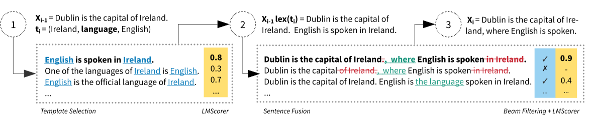

# Data-to-Text Generation with Iterative Text Editing

The code for generating text from RDF triples by iteratively applying sentence fusion on the templates.

A description of the method can be found in: 

 > Zdeněk Kasner & Ondřej Dušek (2020): [Data-to-Text Generation with Iterative Text Editing.](https://www.aclweb.org/anthology/2020.inlg-1.9/) In: *Proceedings of the 13th International Conference on Natural Language Generation (INLG 2020)*.

## Model Overview


## Quickstart

1. Install the requirements
```bash
pip install -r requirements.txt
```
2. Download the datasets and models:
```bash
./download_datasets_and_models.sh
```
3. Run an experiment on the WebNLG dataset with default settings including preprocessing the data, training the model, decoding the data and evaluating the results: 
```bash
./run.sh webnlg
```

## Usage Instructions

### Requirements
- Python 3 & pip
- packages
  - Tensorflow 1.15* (GPU version recommended)
  - PyTorch 🤗 Transformers
  - see `requirements.txt` for the full list

All packages can be installed using
```bash
pip install -r requirements.txt
```
Select `tensorflow-1.15` instead of `tensorflow-1.15-gpu` if you wish not to use the GPU.


**The original implementation of LaserTagger based on BERT and Tensorflow 1.x was used in the experiments. Implementation of the PyTorch version of LaserTagger is currently in progress.*

### Dependencies
All datasets and models can be downloaded using the command: 
```bash
./download_datasets_and_models.sh
```

The following lists the dependencies (datasets, models and external repositiories) downloaded by the script. The script does not re-download the dependencies which are already located in their respective path.

#### Datasets
- [WebNLG dataset](https://github.com/ThiagoCF05/webnlg) (v1.4)
- [Cleaned E2E Challenge dataset](https://github.com/tuetschek/e2e-cleaning)
- [DiscoFuse dataset](https://github.com/google-research-datasets/discofuse) (Wikipedia part)

#### External Repositories
- [LaserTagger](https://github.com/kasnerz/lasertagger) - fork of the original LaserTagger implementation featuring a few changes necessary for integration with the model
- [E2E Metrics](https://github.com/tuetschek/e2e-metrics) - a set of evaluation metrics used in the E2E Challenge

#### Models
- [BERT](https://github.com/google-research/bert) - original TensorFlow implementation from Google (utilized by [LaserTagger](https://github.com/google-research/lasertagger))
- (+ [LMScorer](https://github.com/simonepri/lm-scorer) requires [GPT-2](https://huggingface.co/transformers/model_doc/gpt2.html); downloaded automatically by the `transformers` package)

### Pipeline Overview
The pipeline involves four steps:
1. **preprocessing** the data-to-text datasets for the sentence fusion task
2. **training** the sentence fusion model
3. **running** the decoding algorithm
4. **evaluating** the results

All steps can be run separately by following the instructions below, or all at once using the script
```
./run.sh <experiment>
```
where `<experiment>` can be one of:
- `webnlg` - train and evaluate on the WebNLG dataset
- `e2e` - train and evaluate on the E2E dataset
- `df-webnlg` - train on DiscoFuse and evaluate on WebNLG (zero shot domain adaptation)
- `df-e2e` - train on DiscoFuse and evaluate on E2E (zero shot domain adaptation)

### Preprocessing
Preprocessing involves parsing the original data-to-text datasets and extracting examples for training the sentence fusion model.

Example of using the preprocessing script:
```bash
# preprocessing the WebNLG dataset in the full mode
python3 preprocess.py \
    --dataset "WebNLG" \
    --input "datasets/webnlg/data/v1.4/en/" \
    --mode "full" \
    --splits "train" "test" "dev" \
    --lms_device "cpu"
```

Things you may want to consider:
- The mode for selecting the lexicalizations (`--mode`) can be set to `full`, `best_tgt` or `best`. The modes are described in the supplementary material of the paper.
  - The default mode is `full` and runs on CPU.
  - Modes `best_tgt` and `best`  use the *LMScorer*  and can use GPU (`--lms_device gpu`).
- The templates for the predicates are included in the repository. In order to re-generate simple templates for WebNLG and double templates for E2E, use the flag `--force_generate_templates`. However, note that double templates for E2E have been manually denoised (the generated version will not be identical to the one used in the experiments).
- Using a custom dataset based on RDF triples requires editing `datasets.py`: adding a custom class derived from `Dataset` and overriding relevant methods. The dataset is then selected with the parameter `--dataset` using the class name as an argument.

### Training
Training generally follows the pipeline for finetuning the [LaserTagger](https://github.com/kasnerz/lasertagger) model. However, instead of using individual scripts for each step, the training pipeline is encapsulated in  `train.py`.

Example of using the training script:

```bash
python3 train.py \
    --dataset "WebNLG" \
    --mode "full" \
    --experiment "webnlg_full" \
    --vocab_size 100 \
    --num_train_steps 10000
```

Things you may want to consider:
- The size of the vocabulary determines the number of phrases used by LaserTagger (see the paper for details). The value 100 was used in the final experiments. 
- The wrapper for LaserTagger is implemented in `model_tf.py`. The wrapper calls the methods from the LaserTagger repository (directory `lasertagger_tf`) similarly to the original implementation.
  - *This is a temporary solution: we are working on implementing a custom PyTorch version of LaserTagger, which should be more clear and flexible.*
- For debugging, the number of training steps can be lowered e.g. to 100.
- Parameters `--train_only` and `--export_only` can be used to skip other pipeline phases.
- If you have the correct Tensorflow version (`tensorflow-1.15-gpu`) but a GPU is not used, check if CUDA libraries were linked correctly.

### Decoding
Once the model is trained, the decoding algorithm is used to generate text from RDF triples. See the top figure and/or the paper for the details on the method.

Example of using the decoding script:
```bash
python3 decode.py \
    --dataset "WebNLG" \
    --experiment "webnlg_full" \
    --dataset_dir "datasets/webnlg/data/v1.4/en/" \
    --split "test" \
    --lms_device "cpu" \
    --vocab_size 100
```

Things you may want to consider:
- Decoding will be faster if the LMScorer is allowed to run on GPU (`--lms_device gpu`). Note however this may require a secondary GPU if the GPU is already used for LaserTagger.
- Output will be stored as `out/<experiment>_<vocab_size>_<split>.hyp`.
- Use the flag `--use_e2e_double_templates` for bootstrapping the decoding process from the templates for pairs of triples in the case of the E2E dataset. The templates for single triples (handcrafted for E2E) are used otherwise.
- Use the flag `--no_export` in order to suppress saving the output to the `out` directory.

### Evaluation
The decoded output is evaluated against multiple references using the `e2e-metrics` package.

Example of using the evaluation script:
```bash
python3 evaluate.py \
    --ref_file "data/webnlg/ref/test.ref" \
    --hyp_file "out/webnlg_full_100_test.out" \
    --lowercase
```


## Citation
```
@inproceedings{kasner-dusek-2020-data,
    title = "Data-to-Text Generation with Iterative Text Editing",
    author = "Kasner, Zden{\v{e}}k  and
      Du{\v{s}}ek, Ond{\v{r}}ej",
    booktitle = "Proceedings of the 13th International Conference on Natural Language Generation",
    month = dec,
    year = "2020",
    address = "Dublin, Ireland",
    publisher = "Association for Computational Linguistics",
    url = "https://www.aclweb.org/anthology/2020.inlg-1.9",
    pages = "60--67"
}
```